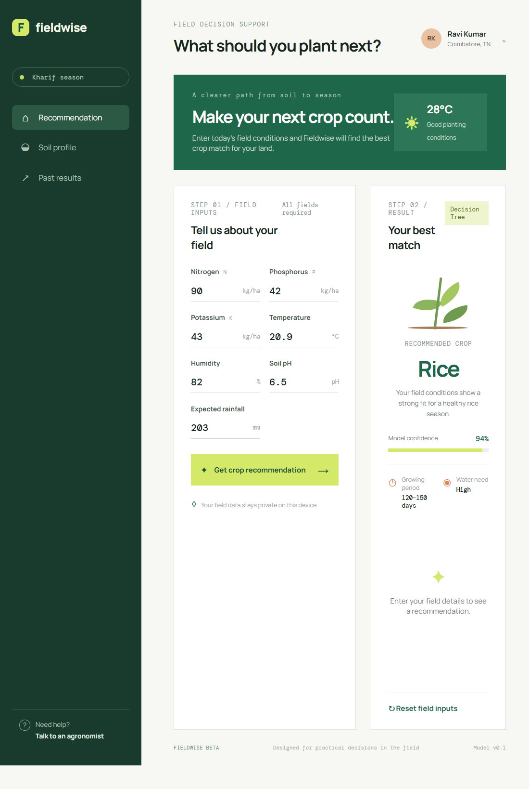

# EDA Report

## User Interface Preview

The following interface was created for entering field conditions and displaying the Decision Tree crop recommendation:



Open the interface from the project root with:

```bash
python -m http.server 8000 --directory ui
```

Then visit `http://localhost:8000` in a browser.

## archive (8)\Crop_recommendation.csv
- Shape: (2200, 8)
- Columns: 8

### Column info
|column|dtype|non-null|unique|
|---|---:|---:|---:|
|N|int64|2200|137|
|P|int64|2200|117|
|K|int64|2200|73|
|temperature|float64|2200|2200|
|humidity|float64|2200|2200|
|ph|float64|2200|2200|
|rainfall|float64|2200|2200|
|label|str|2200|22|

### Missing values

### Suggested target column: **label**

### Head (first 10 rows)
|    |   N |   P |   K |   temperature |   humidity |      ph |   rainfall | label   |
|---:|----:|----:|----:|--------------:|-----------:|--------:|-----------:|:--------|
|  0 |  90 |  42 |  43 |       20.8797 |    82.0027 | 6.50299 |    202.936 | rice    |
|  1 |  85 |  58 |  41 |       21.7705 |    80.3196 | 7.0381  |    226.656 | rice    |
|  2 |  60 |  55 |  44 |       23.0045 |    82.3208 | 7.84021 |    263.964 | rice    |
|  3 |  74 |  35 |  40 |       26.4911 |    80.1584 | 6.9804  |    242.864 | rice    |
|  4 |  78 |  42 |  42 |       20.1302 |    81.6049 | 7.62847 |    262.717 | rice    |
|  5 |  69 |  37 |  42 |       23.058  |    83.3701 | 7.07345 |    251.055 | rice    |
|  6 |  69 |  55 |  38 |       22.7088 |    82.6394 | 5.70081 |    271.325 | rice    |
|  7 |  94 |  53 |  40 |       20.2777 |    82.8941 | 5.71863 |    241.974 | rice    |
|  8 |  89 |  54 |  38 |       24.5159 |    83.5352 | 6.68535 |    230.446 | rice    |
|  9 |  68 |  58 |  38 |       23.224  |    83.0332 | 6.33625 |    221.209 | rice    |


---
## archive (9)\data_core.csv
- Shape: (8000, 9)
- Columns: 9

### Column info
|column|dtype|non-null|unique|
|---|---:|---:|---:|
|Temparature|float64|8000|1816|
|Humidity|float64|8000|3004|
|Moisture|float64|8000|3723|
|Soil Type|str|8000|5|
|Crop Type|str|8000|11|
|Nitrogen|int64|8000|46|
|Potassium|int64|8000|24|
|Phosphorous|int64|8000|47|
|Fertilizer Name|str|8000|7|

### Missing values

### Suggested target column: **Fertilizer Name**

### Head (first 10 rows)
|    |   Temparature |   Humidity |   Moisture | Soil Type   | Crop Type   |   Nitrogen |   Potassium |   Phosphorous | Fertilizer Name   |
|---:|--------------:|-----------:|-----------:|:------------|:------------|-----------:|------------:|--------------:|:------------------|
|  0 |            26 |         52 |         38 | Sandy       | Maize       |         37 |           0 |             0 | Urea              |
|  1 |            29 |         52 |         45 | Loamy       | Sugarcane   |         12 |           0 |            36 | DAP               |
|  2 |            34 |         65 |         62 | Black       | Cotton      |          7 |           9 |            30 | 14-35-14          |
|  3 |            32 |         62 |         34 | Red         | Tobacco     |         22 |           0 |            20 | 28-28             |
|  4 |            28 |         54 |         46 | Clayey      | Paddy       |         35 |           0 |             0 | Urea              |
|  5 |            26 |         52 |         35 | Sandy       | Barley      |         12 |          10 |            13 | 17-17-17          |
|  6 |            25 |         50 |         64 | Red         | Cotton      |          9 |           0 |            10 | 20-20             |
|  7 |            33 |         64 |         50 | Loamy       | Wheat       |         41 |           0 |             0 | Urea              |
|  8 |            30 |         60 |         42 | Sandy       | Millets     |         21 |           0 |            18 | 28-28             |
|  9 |            29 |         58 |         33 | Black       | Oil seeds   |          9 |           7 |            30 | 14-35-14          |


---
## archive (9)\archive (10)\Crop_Recommendation.csv
- Shape: (2200, 8)
- Columns: 8

### Column info
|column|dtype|non-null|unique|
|---|---:|---:|---:|
|Nitrogen|int64|2200|137|
|Phosphorus|int64|2200|117|
|Potassium|int64|2200|73|
|Temperature|float64|2200|2200|
|Humidity|float64|2200|2200|
|pH_Value|float64|2200|2200|
|Rainfall|float64|2200|2200|
|Crop|str|2200|22|

### Missing values

### Suggested target column: **Crop**

### Head (first 10 rows)
|    |   Nitrogen |   Phosphorus |   Potassium |   Temperature |   Humidity |   pH_Value |   Rainfall | Crop   |
|---:|-----------:|-------------:|------------:|--------------:|-----------:|-----------:|-----------:|:-------|
|  0 |         90 |           42 |          43 |       20.8797 |    82.0027 |    6.50299 |    202.936 | Rice   |
|  1 |         85 |           58 |          41 |       21.7705 |    80.3196 |    7.0381  |    226.656 | Rice   |
|  2 |         60 |           55 |          44 |       23.0045 |    82.3208 |    7.84021 |    263.964 | Rice   |
|  3 |         74 |           35 |          40 |       26.4911 |    80.1584 |    6.9804  |    242.864 | Rice   |
|  4 |         78 |           42 |          42 |       20.1302 |    81.6049 |    7.62847 |    262.717 | Rice   |
|  5 |         69 |           37 |          42 |       23.058  |    83.3701 |    7.07345 |    251.055 | Rice   |
|  6 |         69 |           55 |          38 |       22.7088 |    82.6394 |    5.70081 |    271.325 | Rice   |
|  7 |         94 |           53 |          40 |       20.2777 |    82.8941 |    5.71863 |    241.974 | Rice   |
|  8 |         89 |           54 |          38 |       24.5159 |    83.5352 |    6.68535 |    230.446 | Rice   |
|  9 |         68 |           58 |          38 |       23.224  |    83.0332 |    6.33625 |    221.209 | Rice   |


---
